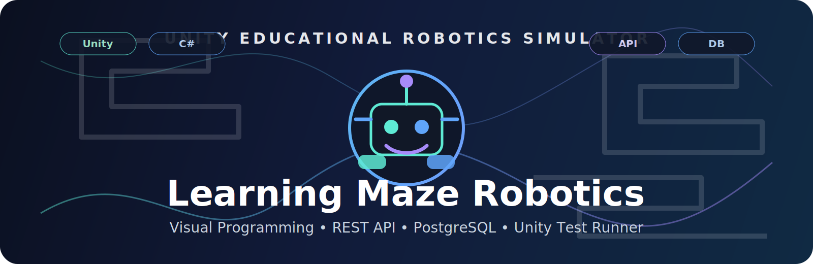
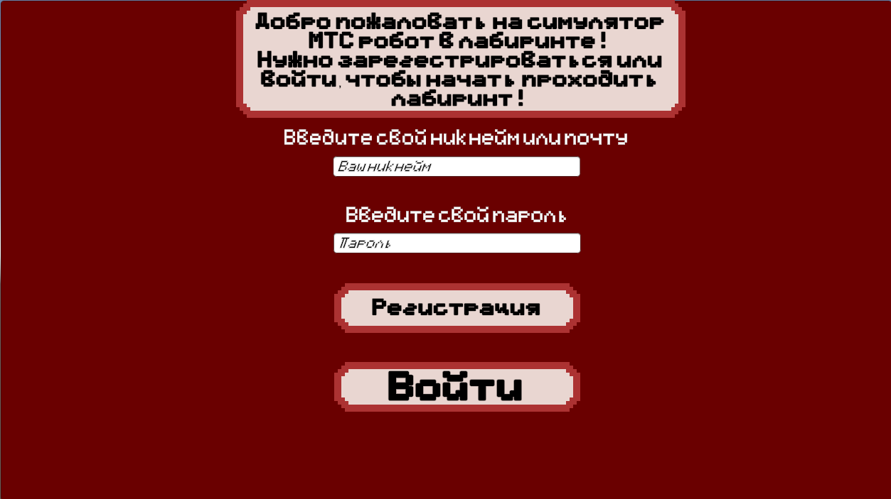
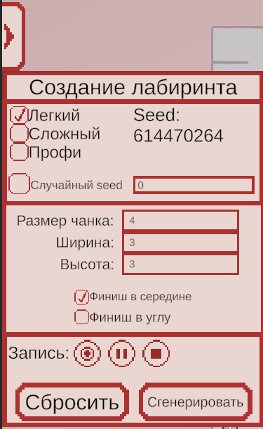
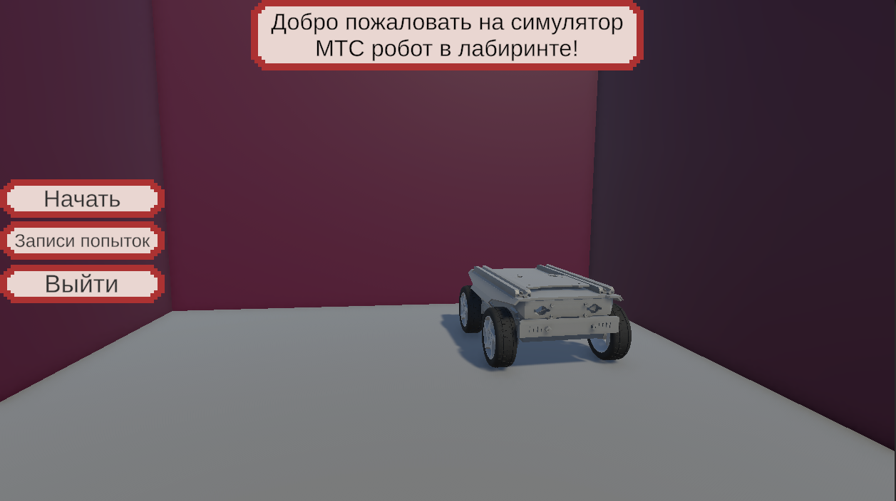
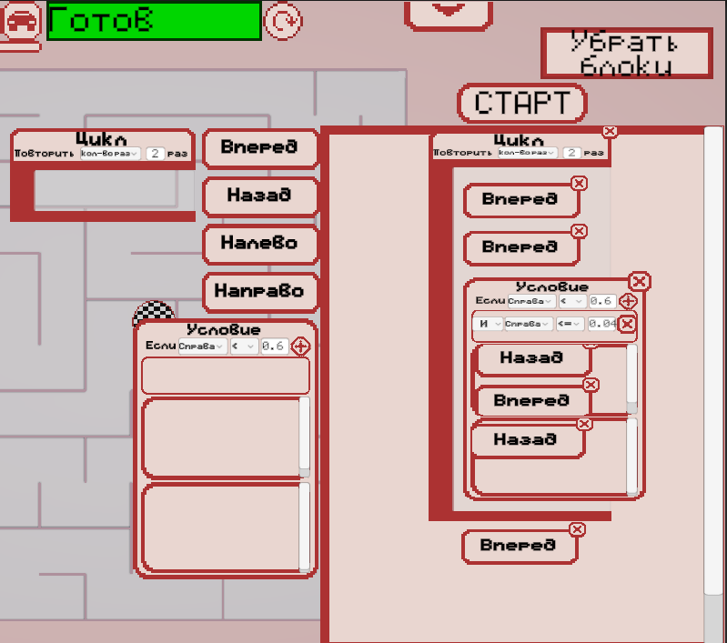
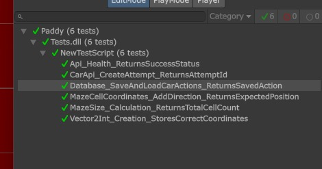
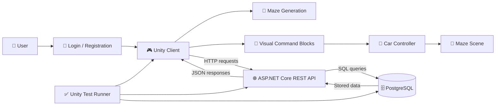
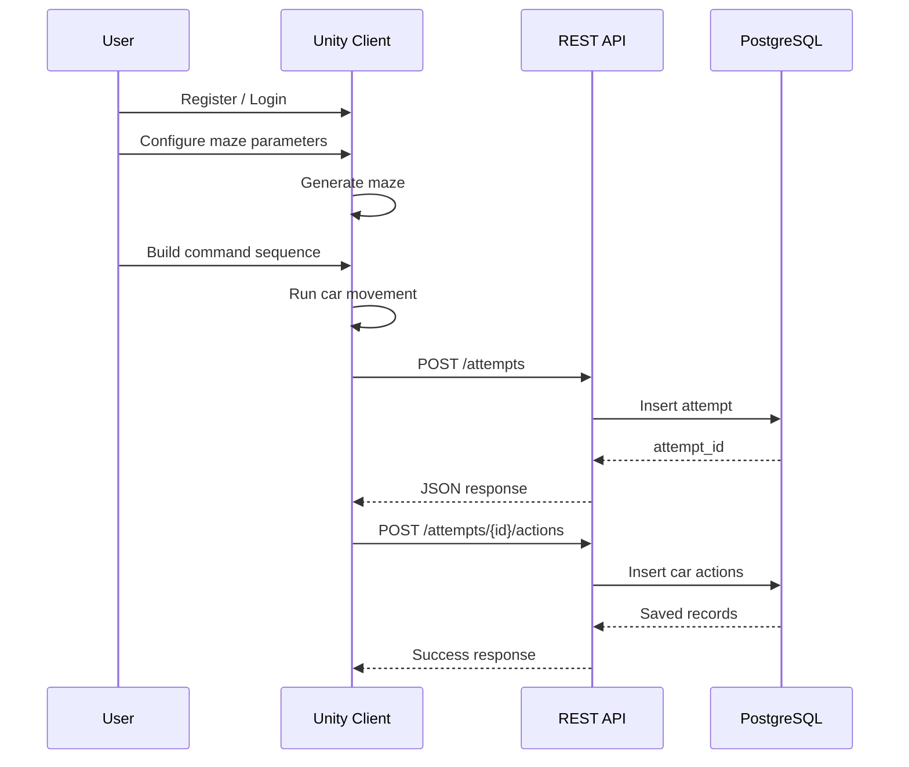
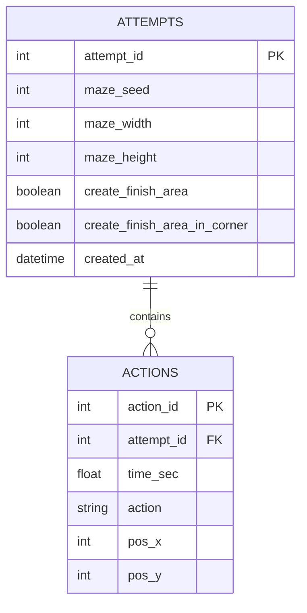

<p align="center">
  
</p>

<div align="center">

# 🤖 Learning Maze Robotics

### Unity-симулятор для обучения робототехнике, визуальному программированию и прохождению лабиринта

<p>
  
  
  
  
  
</p>

<p>
  <a href="#-quick-start">
    
  </a>
  <a href="#-screenshots">
    
  </a>
  <a href="#-testing">
    
  </a>
</p>

<p>
  <a href="#-about-the-project">About</a> •
  <a href="#-screenshots">Screenshots</a> •
  <a href="#-features">Features</a> •
  <a href="#-architecture">Architecture</a> •
  <a href="#-rest-api">API</a> •
  <a href="#-database">Database</a> •
  <a href="#-testing">Testing</a> •
  <a href="#-quick-start">Quick Start</a>
</p>

</div>

---

## 🧠 About the Project

**Learning Maze Robotics** — учебно-практическое приложение на **Unity**, предназначенное для демонстрации принципов алгоритмизации, робототехники и визуального программирования.

Пользователь проходит авторизацию, настраивает параметры генерации лабиринта, создаёт игровую среду и управляет виртуальной машинкой с помощью командных блоков. Данные о попытках прохождения и действиях машинки передаются через REST API и сохраняются в PostgreSQL.

Проект объединяет несколько частей в единую систему:

- интерактивный Unity-клиент;
- окно регистрации и входа;
- генерацию лабиринта по параметрам пользователя;
- визуальное программирование действий машинки;
- серверную часть на ASP.NET Core;
- базу данных PostgreSQL;
- автоматизированные тесты через Unity Test Runner.

---

## 🖼 Screenshots

| Окно входа | Генерация лабиринта |
|---|---|
|  |  |

| Игровая сцена | Визуальное программирование |
|---|---|
|  |  |

| Результаты тестирования |
|---|
|  |

> Для корректного отображения скриншотов положи изображения в папку `docs/screenshots/` с именами:  
> `login-window.png`, `maze-generation.png`, `main-scene.png`, `visual-blocks.png`, `test-runner.png`.

---

## ✨ Features

| Модуль | Возможность |
|---|---|
| 🔐 Authorization | Регистрация и вход пользователя |
| 🧱 Maze Generation | Создание лабиринта по seed, размеру чанка, ширине, высоте и режиму финиша |
| 🎮 Unity Scene | Интерактивная игровая сцена с машинкой и лабиринтом |
| 🧩 Visual Blocks | Управление машинкой через визуальные командные блоки |
| 🤖 Robot Logic | Выполнение команд движения внутри лабиринта |
| 🌐 REST API | Создание попыток прохождения и отправка действий |
| 🗄 PostgreSQL | Хранение попыток, параметров лабиринта и действий машинки |
| ✅ Tests | Unit-тесты, API-тесты и интеграционный тест базы данных |

---

## 🏗 Architecture



### System Layers

| Layer | Technology | Responsibility |
|---|---|---|
| Client | Unity, C# | UI, лабиринт, визуальные блоки, движение машинки |
| Server | ASP.NET Core Web API | Обработка запросов и связь с базой данных |
| Database | PostgreSQL | Хранение попыток прохождения и действий |
| Testing | Unity Test Framework, NUnit | Проверка логики, API и сохранения данных |

---

## 🔄 Runtime Flow



---

## 🌐 REST API

REST API связывает Unity-клиент с базой данных PostgreSQL.

| Method | Endpoint | Description |
|---|---|---|
| `GET` | `/health` | Проверка доступности API |
| `POST` | `/attempts` | Создание новой попытки прохождения лабиринта |
| `POST` | `/attempts/{id}/actions` | Сохранение действий машинки |
| `GET` | `/attempts/{id}/actions` | Получение сохранённых действий |

### Create Attempt Request

```json
{
  "maze_seed": 123,
  "maze_width": 3,
  "maze_height": 3,
  "create_finish_area": true,
  "create_finish_area_in_corner": false
}
```

### Create Attempt Response

```json
{
  "attempt_id": 1
}
```

### Save Actions Request

```json
{
  "records": [
    {
      "time_sec": 1.5,
      "action": "MOVE",
      "pos_x": 2,
      "pos_y": 3
    }
  ]
}
```

---

## 🗄 Database

База данных используется для хранения попыток прохождения лабиринта и действий машинки.



| Table | Purpose |
|---|---|
| `attempts` | Параметры созданного лабиринта и попытки прохождения |
| `actions` | Последовательность действий машинки в рамках попытки |

---

## ✅ Testing

В проекте реализованы обычные unit-тесты и интеграционные проверки API/БД.

| Test | Type | What is checked |
|---|---|---|
| `Vector2Int_Creation_StoresCorrectCoordinates` | Unit | Корректное создание координаты клетки |
| `MazeCellCoordinates_AddDirection_ReturnsExpectedPosition` | Unit | Смещение координаты при движении вправо |
| `MazeSize_Calculation_ReturnsTotalCellCount` | Unit | Расчёт общего размера лабиринта |
| `Api_Health_ReturnsSuccessStatus` | API | Доступность серверной части |
| `CarApi_CreateAttempt_ReturnsAttemptId` | API | Создание попытки прохождения через API |
| `Database_SaveAndLoadCarActions_ReturnsSavedAction` | Integration | Сохранение и получение действий машинки через API и PostgreSQL |

<p align="center">
  
</p>

---

## 🚀 Quick Start

### 1. Clone repository

```bash
git clone https://github.com/vpt-student-projects/learning-maze-robotics-unity.git
cd learning-maze-robotics-unity
```

### 2. Open Unity project

1. Open **Unity Hub**.
2. Click **Add project**.
3. Select the project folder.
4. Open the project with the required Unity version.

### 3. Start PostgreSQL

Make sure PostgreSQL is installed and the database exists.

Recommended database name:

```text
maze_db
```

### 4. Start API server

```bash
cd MazeAttemptsApi
dotnet run
```

Default API URL:

```text
http://localhost:5081
```

### 5. Run Unity scene

Open the main scene and press **Play**.

### 6. Run tests

```text
Window → General → Test Runner → EditMode → Run All
```

---

## 📁 Project Structure

<details>
<summary>Click to expand</summary>

```text
LearningMazeRobotics/
├── Assets/
│   ├── CoreScripts/
│   ├── Scenes/
│   ├── Tests/
│   └── UI/
├── MazeAttemptsApi/
│   ├── Controllers/
│   ├── Models/
│   └── Program.cs
├── docs/
│   ├── hero/
│   │   └── banner.svg
│   └── screenshots/
│       ├── login-window.png
│       ├── maze-generation.png
│       ├── main-scene.png
│       ├── visual-blocks.png
│       └── test-runner.png
├── README.md
└── .gitignore
```

</details>

---

## 🎯 Educational Value

Проект демонстрирует, как игровые технологии могут применяться для обучения робототехнике и алгоритмизации. Пользователь не просто запускает готовую сцену, а взаимодействует с системой: задаёт параметры лабиринта, формирует последовательность команд, запускает машинку и получает результат выполнения.

Такой подход помогает изучать:

- алгоритмическое мышление;
- последовательность команд;
- координатную логику;
- основы движения робота в среде;
- взаимодействие клиента, сервера и базы данных;
- тестирование программной системы.

---

## 📌 Notes for Reviewers

This repository is not only a Unity scene, but a complete educational software prototype that includes:

- a visual Unity client;
- user authorization interface;
- configurable maze generation;
- visual command-based robot control;
- backend REST API;
- persistent PostgreSQL storage;
- automated tests for logic, API and database interaction;
- clear documentation and architecture diagrams.

---

<div align="center">

### 🤖 Learning Maze Robotics

**Unity • C# • ASP.NET Core • PostgreSQL • Testing • Visual Programming**

</div>
